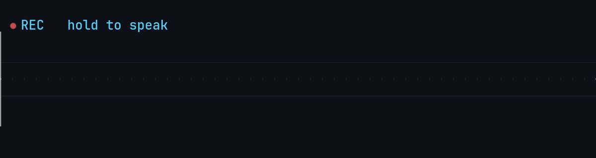

<div align="center">



# 🎙️ voice-dictate

**Push-to-talk voice dictation for Wayland / KDE Plasma.**
Hold a key, speak, release — the text lands in whatever window is focused.

<sub>
Русский и английский · каждый на своей клавише · распознавание на Intel Arc iGPU
</sub>

<br>


</div>

---

Built because on KDE Wayland the usual tricks don't work: `wtype` needs a
virtual-keyboard protocol KWin doesn't expose, and `ydotool type` can't emit
Cyrillic. This takes a different route — see [How it works](#-how-it-works).

## ✨ Features

- **Push-to-talk** — hold a key while speaking, release to transcribe and insert.
- **A key per language** — Right Ctrl dictates Russian, another key English.
  Naming the language beats detecting it: detection is a whole extra encoder pass
  and it misreads short takes.
- **Runs on the GPU** — whisper `large-v3` on the Intel Arc iGPU via OpenVINO,
  **0.67 s** a take, with automatic fallback to faster-whisper on the CPU if the
  GPU stack is missing.
- **Never blocks** — releasing the key hands the take to a worker thread, so the
  next thought can be recorded while the previous one is still being recognised.
- **Global hotkey on Wayland** — keys are read straight from the kernel via
  `evdev`, so it works in any app regardless of the compositor, and keyboards
  plugged in later are picked up automatically.
- **Clipboard-backed paste** — the text is left in the clipboard, so if the
  auto-paste misses (focus moved off the field) you can just Ctrl+V it.
- **Optional polish mode** — hold both dictation keys and the take is rewritten
  through a Claude model before pasting; the single-key path stays verbatim.
- **Mic conditioning** — the capture is cleaned through ffmpeg (high-pass, mild
  denoise, speech levelling, limiter) before recognition, touching only the
  dictation buffer and never the system mic.
- **Your own vocabulary** — `VD_PROMPT` biases recognition toward the names and
  jargon you actually use, within whisper's 223-token budget.

## ⚙️ How it works

```
hold key ──▶ pw-record (48 kHz stereo WAV)
release  ──▶ worker thread ─ you can start the next take right away
         ──▶ ffmpeg (high-pass · denoise · level · limiter → 16 kHz mono)
         ──▶ Silero VAD ──▶ whisper large-v3 on the Arc iGPU ──▶ text
         ──▶ wl-copy + ydotool Ctrl+V ──▶ focused window (text kept in clipboard)
```

- Keys are captured with **evdev** (raw kernel input) and their real state is read
  via `active_keys()` (`EVIOCGKEY`), so a missed press or release can never leave
  recording stuck.
- Text is inserted via **clipboard + `ydotool` Ctrl+V**. A clipboard-free Unicode
  "type" isn't possible on KWin (no `virtual_keyboard_manager_v1`, no
  `input-method-v2`), so the text stays in the clipboard as a fallback.
- Pick a **non-printing** key. Keys are not grabbed, so a letter key would leak
  into the focused app — `Right Ctrl` is the sensible default, like Discord PTT.

### The keys

| hold | what it does |
|---|---|
| `Right Ctrl` | dictate in `VOICE_DICTATE_LANG` (Russian by default) |
| `VD_PTT_KEY_2` | dictate in `VD_PTT_LANG_2` (English by default) |
| both together | polish — rewrite the take through Claude, language detected |

Press ordering does not matter for the chord: recording starts on whichever key
lands first and is re-labelled if the other joins, so nothing spoken is lost.

There's also a legacy **toggle** variant (`voice-dictate.sh` +
`transcribe_daemon.py`, press once to start / again to stop) bound to a KDE
global shortcut — kept as a fallback.

## 📦 Requirements

- Linux, Wayland (developed on KDE Plasma 6)
- Python 3.10+
- `pipewire`/`pulseaudio` (`pw-record`, `parecord`, or `arecord`)
- `ffmpeg` — for mic conditioning (optional; `VD_CLEAN=0` runs without it)
- [`ydotool`](https://github.com/ReimuNotMoe/ydotool) + `ydotoold` running
- `wl-clipboard` (`wl-copy`)
- `libnotify` (`notify-send`), `pulseaudio-utils`/`pipewire` (`paplay`)
- Read access to `/dev/input/event*` (be in the `input` group)
- **For the GPU backend** (optional, and the default when present): Intel compute
  runtime + OpenVINO — `sudo ./install-openvino.sh` sets it all up. Without it the
  daemon falls back to faster-whisper on the CPU by itself.

## 🚀 Install

```bash
git clone https://github.com/steveast/voice-dictate
cd voice-dictate
./install.sh   # runs in place — clone wherever you like
```

`install.sh` creates the venv, installs deps, and installs the systemd user
service. It will print the **privileged one-time steps** it can't do itself:

```bash
# 1) allow reading the keyboard (evdev) — relogin makes it permanent,
#    setfacl makes it work right now without a relogin
sudo usermod -aG input "$USER"
sudo setfacl -m 'u:'"$USER"':r' /dev/input/event*

# 2) allow ydotool to inject keys (uinput)
sudo install -m 644 udev/99-uinput.rules /etc/udev/rules.d/99-uinput.rules
sudo udevadm control --reload && sudo udevadm trigger
systemctl --user enable --now ydotool.service
```

Then enable the dictation service:

```bash
systemctl --user enable --now voice-ptt.service
```

> ⚠️ zsh eats the `:r` in `u:$USER:r` (it's a modifier) — quote it as shown.

## 🎧 Usage

Hold **Right Ctrl**, speak, release. The text appears in the focused window.

The first line of the model log confirms it's ready:

```bash
journalctl --user -u voice-ptt -f
```

## ⚡ Running on the Intel Arc iGPU

Recognition runs on the integrated GPU through OpenVINO by default, and falls
back to faster-whisper on the CPU by itself if the runtime, the model or the
device is missing — a broken GPU setup degrades to slower dictation, never to no
dictation. `sudo ./install-openvino.sh` installs everything needed.

Measured over 376 real takes on a Core Ultra 7 255H:

| backend | model | per take |
|---|---|---|
| faster-whisper, CPU, beam 5 | `medium` | 3.80 s |
| **OpenVINO, Arc iGPU, greedy** | **`large-v3`** | **0.67 s** |

The interesting part is that this is not a speed-for-accuracy trade. OpenVINO
cannot do beam search on the GPU, which sounds like a quality loss — but the
speedup is large enough to afford a *bigger model*, and `large-v3` greedy beats
`medium` beam-5 comfortably: `paper trading` instead of "PEPPER трейдинг",
"Внеси" instead of "Неси", `РФ` instead of `RF`. On the GPU `large-v3` costs
about what `medium` does (0.67 s vs 0.51 s), because both are dominated by
whisper's fixed 30-second window rather than by model size. So the model-size
trade-off that matters so much on CPU simply stops applying.

Two things to know:

- **Non-speech takes.** faster-whisper runs Silero VAD internally; OpenVINO does
  not, and handed a dead capture or a key knock, whisper invents a subtitle
  credit ("Subtitles by the Amara.org community") which then gets pasted. The
  OpenVINO path therefore runs the same VAD first, backed by an RMS gate
  (`VD_SILENCE_RMS`) and a filter for whisper's stock hallucinations.
- **`VD_PROMPT` on smaller models.** With `medium`, an `initial_prompt` would
  occasionally collapse a long take to a fragment — reliably on CPU, at random on
  GPU, and `hotwords` was worse still. `large-v3` does not do this (0 of 13 long
  takes), so the prompt stays on. Worth remembering if you switch models.

Set `VD_OV_DEVICE=NPU` to try the neural engine instead; that needs membership of
the `render` group, which `install-openvino.sh` arranges, and a fresh login.

## ⏱️ Latency

Releasing the key never blocks: the take goes to a worker thread and you can
start the next one immediately, so a thought that arrives mid-transcription is
no longer lost. Takes are recognised in the order spoken and each is pasted the
moment it is ready, between presses — never into a recording that is already
running.

That hides the wait but doesn't shorten it, and on CPU the wait is mostly
**fixed**: whisper always encodes a padded 30-second window, so a 2-second take
costs nearly as much as a 20-second one. Two things follow.

`large-v3-turbo` is the wrong instinct for short dictation. Turbo shrinks the
*decoder*; its encoder is the full large-v3 one, and the encoder is what a short
take pays for. Measured on a Core Ultra 7 255H, 2-second take / 20-second take:

| model | 2s take | 20s take |
|---|---|---|
| `small` | 1.25 s | 2.20 s |
| `medium` | 3.19 s | 5.18 s |
| `large-v3-turbo` | 5.12 s | 5.93 s |

And more threads is not more speed on a hybrid CPU: ctranslate2 splits each
layer evenly, so P-cores idle while E-cores finish. 16 threads measured *slower*
than 8. Hence the `min(8, cores)` default.

Whisper also competes with whatever else is running — a busy browser can triple
these numbers. Within the CPU engine that is close to the floor: beam size,
`initial_prompt` and the VAD filter all measured within noise, and batching long
takes turned out to be a GPU optimisation with nothing to gain on a CPU whose
threads are already saturated. Getting past it needed different silicon, which is
what the [Arc iGPU backend](#-running-on-the-intel-arc-igpu) is.

## 🔬 Choosing a model on evidence

Model size is a real trade-off — a smaller one is dramatically faster and gets
more wrong — and it is impossible to judge from a couple of samples. Two tools:

- `./compare-models.sh` scores **one** freshly dictated reference phrase against
  a list of expected terms. Good for a quick vocabulary check.
- `./compare-takes.py` replays **everything you have actually dictated** through
  several models and prints only the takes where they disagree. Where they agree
  the audio was clear and the choice did not matter.

For the second one, point `VD_KEEP_DIR` at a directory and dictate normally for
a few days; each take is archived as the conditioned 16 kHz copy whisper saw,
next to a `.txt` of what it heard. Then:

```bash
./compare-takes.py                                  # all of it, small/medium/turbo
./compare-takes.py --models small,medium --limit 40 # the newest 40 takes
```

It reads `VD_PROMPT` from the running unit and the language from each take's
filename, so the replay matches what the daemon really does.

This is worth the trouble because intuition is wrong here often enough to matter.
Replaying 66 real takes is what showed that `large-v3-turbo`, the largest model,
is **not** the accuracy answer: it wins on proper nouns and foreign words but
loses on plain Russian, breaking takes that `small` got right. It also killed
three plausible speed ideas that measured as noise, including batching long
takes — a GPU optimisation with nothing to gain on a thread-saturated CPU.

> Both `VD_KEEP_DIR` and `VD_LOG_TEXT` are off by default and should stay off
> outside such an experiment: one writes recordings of everything you say to
> disk, the other puts every dictation in the system journal.

## ✨ Polish mode (optional)

A second push-to-talk key rewrites the dictation before pasting — fixes grammar
and punctuation, tidies rambling phrasing, and adds an occasional emoji at most —
while the normal key still pastes the raw transcription. Great for chat and notes; keep
the verbatim key for terminals, code, and search boxes.

```
hold polish key ──▶ pw-record ──▶ faster-whisper ──▶ Claude (rewrite) ──▶ paste
```

- Give it a **dedicated key** via `VD_POLISH_KEY` (a spare key held on its own —
  a shared-key chord like Ctrl+Shift is fiddly because of press ordering).
  Multiple keys are allowed (comma-separated), so each keyboard can use a key it
  actually has.
- The rewrite reuses the **Claude Code CLI's** OAuth token from
  `~/.claude/.credentials.json` (so you need Claude Code installed and logged in)
  — no separate API key. Model defaults to `claude-haiku-4-5` (fast, ~2 s).
- If the token is stale it pastes the **raw** text and shows a hint, so a
  dictation is never lost.
- A distinct start chime (`polish_start.wav`) tells you which mode you're in.
- The dictation is **edited, never obeyed**. This matters because polish is
  perfect for composing prompts for some *other* assistant: dictate "write me a
  function that parses JSON" and a naive setup returns the function. Three things
  keep the editor in its role — the fragment arrives fenced in `<fragment>` tags,
  the task is restated *after* it (rules that sit only in the system prompt lose
  to an imperative arriving last), and the reply is prefilled with `<edited>` so
  it cannot open with "I notice you asked…". Override `VD_POLISH_PROMPT` freely;
  the fencing, the restated task, and the detected-language line are appended
  around it either way.

> Some keys (a laptop vendor key, the Menu/Compose key) fire an OS action or
> emit a modifier combo. If that gets in the way, remap the physical key to an
> inert one (e.g. `F24`) with a udev `hwdb` rule and point `VD_POLISH_KEY` at it.

## 🎚️ Mic conditioning (optional, on by default)

Cheap USB mics are quiet and noisy. But route dictation through the *system*
default source (an EasyEffects/RNNoise chain) and you'll fight its VAD gate,
which clips word starts and tanks accuracy. So the cleanup is done **in-process
on the recorded buffer** instead — the system mic stays raw and calls/other apps
are untouched.

On key release the recording is passed through one `ffmpeg` filter chain:

```
highpass=f=90        → cut sub-90 Hz rumble & handling noise
afftdn=nr=12:nf=-25  → gentle FFT denoise (≈no-op in a quiet room, helps when noisy)
speechnorm=…         → raise the level (the "louder & clearer" win), capped so
                       silence/pauses are NOT amplified into loud hiss
alimiter=…           → catch peaks so nothing clips
                     → resampled to whisper's 16 kHz mono
```

It's all best-effort: if `ffmpeg` is missing, the chain errors, or you set
`VD_CLEAN=0`, dictation falls back to the plain raw 16 kHz capture — nothing is
ever lost. Tune or replace the chain with `VD_CLEAN_FILTER` (e.g. swap `afftdn`
for `arnndn=m=/path/to/model.rnnn` to use the RNNoise **AI** denoiser once you
have a `.rnnn` model).

## 🔧 Configuration

Set these in `systemd/voice-ptt.service` (`Environment=…`) or the shell env:

| Variable | Default | Meaning |
|---|---|---|
| `VD_PTT_KEY` | `KEY_RIGHTCTRL` | evdev key to hold ([key names](https://github.com/torvalds/linux/blob/master/include/uapi/linux/input-event-codes.h)) |
| `VD_PTT_MOD` | *(empty)* | optional modifier(s), comma-separated; empty = single-key hold |
| `VD_PTT_KEY_2` | *(empty)* | second dictation key, bound to its own language; empty = off |
| `VD_PTT_LANG_2` | `en` | language for that second key |
| `VOICE_DICTATE_BACKEND` | `openvino` | `openvino` (Arc iGPU) or `faster-whisper` (CPU). Falls back to the CPU engine on its own if OpenVINO can't start |
| `VD_OV_MODEL` | `~/.local/share/voice-dictate/models/whisper-large-v3-int8-ov` | OpenVINO IR model directory |
| `VD_OV_DEVICE` | `GPU` | OpenVINO device: `GPU`, `NPU` or `CPU` |
| `VD_SILENCE_RMS` | `0.002` | skip takes quieter than this instead of letting whisper invent subtitle credits for them |
| `VOICE_DICTATE_MODEL` | `mobiuslabsgmbh/faster-whisper-large-v3-turbo` | model for the **CPU fallback** |
| `VOICE_DICTATE_LANG` | `ru` | language code, or `auto` to detect per press — see below |
| `VOICE_DICTATE_COMPUTE` | `int8` | ctranslate2 compute type |
| `VOICE_DICTATE_THREADS` | `min(8, cores)` | CPU threads; capped because hybrid P/E-core CPUs get *slower* with all of them |
| `VD_PASTE_KEYS` | `29:1 47:1 47:0 29:0` | ydotool codes for paste (Ctrl+V); for terminals use Ctrl+Shift+V: `29:1 42:1 47:1 47:0 42:0 29:0` |
| `VD_MIN_MS` | `250` | ignore presses shorter than this |
| `VD_RESCAN_SEC` | `2` | how often to look for keyboards plugged in after startup |
| `VD_LOG_TEXT` | `0` | log the recognised text, not just its length — off by default, since it puts every dictation in the journal |
| `VD_KEEP_DIR` | *(empty)* | archive each take's audio + transcript here, for replaying through another model — off by default, since it records everything you say |
| `VD_MAX_SEC` | `180` | safety cap on a single recording |
| `VD_PROMPT` | *(empty)* | `initial_prompt` to bias recognition toward your vocabulary (names, jargon, tickers). **Max 223 tokens** — see below |
| `VD_BEAM` | `5` | decoding beam size; `1` = greedy (faster, slightly less accurate) |
| `VD_TRAILING` | *(one space)* | text appended after each dictation so phrases don't glue together; `\n`/`\t` honoured, empty to disable |

#### The 223-token prompt budget

Whisper reserves `max_length // 2 - 1` = **223 tokens** for the prompt, and
faster-whisper keeps the **tail** of anything longer — the vocabulary at the
front is dropped with no error and no log line. The symptom is indistinguishable
from the model simply mishearing those words.

The daemon logs the count on startup (`VD_PROMPT: 153/223 tokens`) and warns
loudly on overflow, naming the terms it had to drop.

Because the budget is tight, spend it on words that actually get misheard.
Common anglicisms whisper already knows (`докер`, `лог`, `кэш`, `React`,
`PostgreSQL`) are wasted tokens; project-specific identifiers and proper nouns
(`book_ticker`, `BTCUSDT`, `msx`, `материализатор`) are what the bias is for.
Note that the prompt only helps words that are *in* it, so every wasted token is
a term you dropped.

#### Speaking two languages

Two ways, and the cheap one is a key per language:

```
VD_PTT_KEY=KEY_RIGHTCTRL        VOICE_DICTATE_LANG=ru   # hold for Russian
VD_PTT_KEY_2=KEY_F23,KEY_F24    VD_PTT_LANG_2=en        # hold for English
```

Pick a genuinely spare key for the second language. Right Alt looks tempting and
is a trap: it is AltGr, so on a multi-layout desktop holding it switches the
keyboard layout out from under you. Comma-separate several keys when your
keyboards don't share a spare one — any of them starts an English take.

Naming the language beats detecting it on both counts. Detection is an extra
encoder pass over the padded 30-second window — about **1.8x** the cost of a
short take — and it is unreliable exactly where dictation is shortest: a 1.5s
Russian clip came back as English from every model size tested, `small` and
`large-v3-turbo` alike. A key you are already holding carries the same
information for free.

The alternative is `VOICE_DICTATE_LANG=auto`, which lets whisper decide per
press. Detection runs on the encoder output and never sees `VD_PROMPT`, so the
glossary cannot skew *which* language is chosen — but it does steer the decode,
so a Russian-only glossary drags English dictation toward transliteration. Give
the prompt a clause per language, within the same 223-token budget.

Either way, one take is one language: a Russian sentence with English terms in
it is a `VD_PROMPT` job, not a detection job.

Polish sits on the chord — hold **both** dictation keys — so it costs no key of
its own, and it is the one path that still detects the language (`VD_POLISH_LANG`,
default `auto`), since the API call dominates its latency anyway. Press ordering
does not matter: the recording starts on whichever key lands first and is
re-labelled if the other joins, so nothing spoken is lost.

Polish is told the detected language outright rather than inferring it from the
text. "Keep the input language" is not enough on its own: the built-in
`VD_POLISH_PROMPT` is written in Russian, and that pull alone is enough to make
the model translate English dictation into Russian. If you replace the prompt,
keep in mind the daemon appends the language directive after it.

### Mic conditioning

| Variable | Default | Meaning |
|---|---|---|
| `VD_CLEAN` | `1` | master switch; `0` (or no `ffmpeg`) = raw 16 kHz capture, no post-processing |
| `VD_REC_RATE` | `48000` | capture sample rate for the conditioned path (the card's cleaner altset) |
| `VD_REC_CH` | `2` | capture channels for the conditioned path |
| `VD_CLEAN_FILTER` | *(tuned chain)* | ffmpeg `-af` chain: high-pass · denoise · speech-level · limiter. Empty = resample only. Swap `afftdn` → `arnndn=m=<model.rnnn>` for RNNoise AI denoise |

### Polish mode

| Variable | Default | Meaning |
|---|---|---|
| `VD_POLISH_KEY` | *(empty)* | dedicated key(s) for the polish hold; comma-separated for multiple keyboards; empty disables polish |
| `VD_POLISH_MOD` | `Ctrl+Shift` | extra modifier groups (used only when no dedicated key is set) |
| `VD_POLISH_CHORD` | `1` | holding both dictation keys at once means polish; needs `VD_PTT_KEY_2` |
| `VD_POLISH_LANG` | `auto` | language for a polish take; `auto` detects it |
| `VD_POLISH_MODEL` | `claude-haiku-4-5` | Claude model for the rewrite |
| `VD_POLISH_PROMPT` | *(built-in)* | system prompt steering the rewrite |
| `VD_POLISH_START_WAV` | `polish_start.wav` | distinct start beep for polish mode |
| `VD_POLISH_CREDS` | `~/.claude/.credentials.json` | Claude Code OAuth token source |
| `VD_POLISH_TIMEOUT` | `20` | seconds to wait on the API before falling back to raw |

## 🩺 Troubleshooting

- **`no keyboard exposes …`** → you lack read access to `/dev/input` (see install step 1).
- **Nothing pastes** → `ydotoold` isn't running or lacks `/dev/uinput` access (install step 2).
- **The PTT key types a character** → you picked a printing key; use a modifier/spare key.
- **A keyboard plugged in later does nothing** → shouldn't happen any more: the
  daemon rescans `/dev/input` every `VD_RESCAN_SEC` and logs `keyboard plugged
  in: …`. If that line never appears, the new node isn't readable — check the
  install step 1 permissions, which udev applies per device.
- **Cold start ~35 s once** → first model load; it stays warm afterwards.

## 📄 License

MIT — see [LICENSE](LICENSE).
